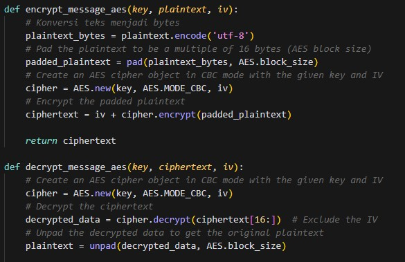
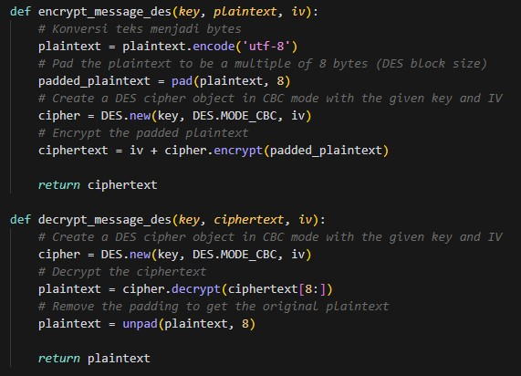
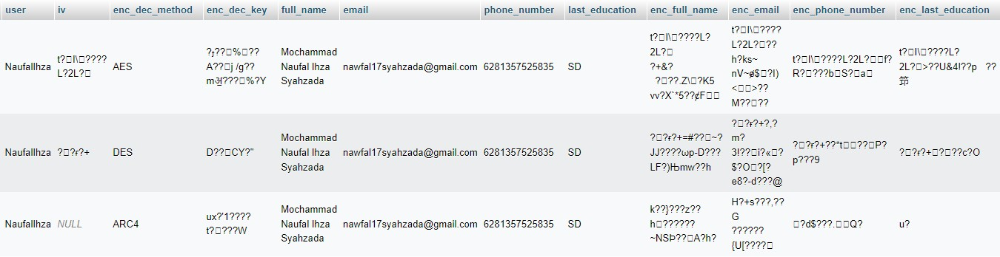
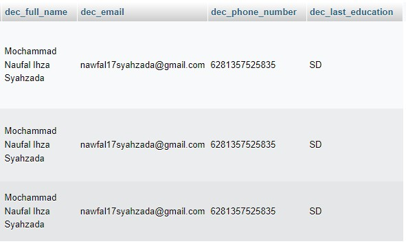

# Information-Security-Group-Project

## Group IUP4

Group Members:
| No |  Name    |  NRP  |
| ---       |   ---     |---  |
|     1     |     Muhammad Dzaky Farhan    | 5025211069 |
|     2     |     Khairiya Maisa Putri    | 5025211192 |
|     3     |     Ahmad Danindra Nugroho    |  5025211259 |
|     4     |     Mochammad Naufal Ihza Syahzada    |  5025211260 |

## Why Python?
Python is an excellent choice for creating a program to encrypt and decrypt inputs using methods like AES, DES, and ARC4 for several reasons. There are a few reasons why we decided to use python to do this assignment. First, Python offers a wide range of libraries and modules, such as PyCryptodome and Cryptography, that provide robust and well-documented implementations of encryption algorithms, making it relatively easy to implement encryption and decryption functionality. Second, Python's clean and simple syntax makes it accessible for developers of all skill levels, which can be particularly advantageous when working on security-related tasks like encryption.

Additionally, Python is a highly portable language, allowing our program to run on various platforms without major modifications. Overall, Python's combination of accessibility, comprehensive libraries, and a supportive community makes it a compelling choice for developing encryption and decryption programs.

## Methods Explanation

The encryption and decryption methods that we were told to do are AES, DES, and ARC4. Let’s get to know more about those 3 encryption decryption methods.
1. AES (Advanced Encryption Standard): AES is a widely adopted symmetric encryption algorithm known for its security and efficiency. It operates on fixed-size blocks of data, typically 128, 192, or 256 bits, and uses a series of substitution and permutation operations in multiple rounds to transform the data securely. AES has become the de facto standard for encryption due to its strong resistance to attacks and broad support across various platforms. It's used in a wide range of applications, from securing data in transit over the internet to encrypting sensitive files and communications.

2. DES (Data Encryption Standard): DES was one of the earliest symmetric encryption standards, though it is considered outdated and insecure for today's computing environment. DES uses a 56-bit key to encrypt and decrypt data in 64-bit blocks. It is vulnerable to brute-force attacks, and for this reason, it has largely been replaced by more secure algorithms like AES. However, it is still occasionally encountered in legacy systems and serves as a historical benchmark in the field of cryptography.

3. ARC4 (Alleged RC4): ARC4 is a stream cipher that generates a pseudorandom keystream based on a secret key. While it was once widely used, ARC4 is now considered less secure due to vulnerabilities in its key scheduling algorithm. It's known for its simplicity and speed, making it suitable for lightweight applications where security requirements are not as strict. Nevertheless, it is generally recommended to use more robust encryption algorithms like AES for securing sensitive data in modern applications.
In summary, AES is a highly secure and efficient encryption standard that is widely used today, while DES is considered outdated and not recommended for new applications. ARC4, on the other hand, is simple and fast but has known security weaknesses, making it less suitable for applications with stringent security requirements. When choosing an encryption method, it's crucial to consider the specific security needs of your application and opt for the most appropriate algorithm accordingly.

## Ranks from the fastest to the slowest:

1. ARC4 (Alleged RC4): ARC4 is known for its speed and simplicity. It is a stream cipher, which means it encrypts and decrypts data on a byte-by-byte basis. This makes it extremely fast, especially for lightweight applications. However, its speed comes at the cost of reduced security, as it has known vulnerabilities.
2. AES (Advanced Encryption Standard): AES is considered a balance between security and speed. While it is not as fast as ARC4 due to its more complex operations and multiple rounds of processing, it is highly efficient, and its performance is generally excellent for most applications. AES is widely used in practice because it provides a good compromise between security and speed.
3. DES (Data Encryption Standard): DES is the slowest of the three, primarily because it was designed in the 1970s and uses outdated encryption techniques. Its 56-bit key length and relatively simple operations make it the slowest among these three encryption methods. Furthermore, its security is now insufficient for modern standards, which is why it's not recommended for use in contemporary applications.

## Mechanism of Encrypt and Decrypt
- AES:

- DES:

- ARC4:

## Example
Here are some of the examples from our codes, which includes the original input, encrypted data, and decrypted daya.

## Why those datas?
We consider full names, email addresses, phone numbers, last education details, PDF files, pictures, and videos as private data primarily due to their personal and sensitive nature. Full names, email addresses, and phone numbers are unique identifiers linked to individuals and can be used for identity theft, spam, or unauthorized contact. Last education information may contain personal history and qualifications that individuals may not want to disclose publicly. PDF files, pictures, and videos can contain personal or confidential content, making them sensitive and subject to privacy concerns. Protecting this data helps safeguard individuals' personal information and ensures privacy and security.

## Complication:
Turns out using python to do encrypt and decrypt is not as easy as we thought
